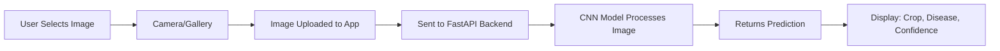

# 🌱 CropSense

<p align="center">
  
</p>

<p align="center">
  <strong>AI-Powered Crop Disease Detection for Farmers</strong>
</p>

<p align="center">
  
  
  
  
  
</p>

---

## 📖 Overview

**CropSense** is an Android application that leverages Deep Learning (Convolutional Neural Networks) to help farmers and agricultural professionals identify crop diseases instantly. Simply capture or upload a photo of a crop leaf, and receive:

- 🌾 **Crop Type** identification
- 🦠 **Disease Name** detection
- 📊 **Confidence Score** for prediction reliability

The app combines modern Android development with powerful machine learning to make crop disease diagnosis accessible and accurate.

---

## ✨ Key Features

| Feature | Description |
|---------|-------------|
| 📷 **Camera Integration** | Capture leaf images directly within the app |
| 🖼️ **Gallery Upload** | Select existing images from your device |
| 🤖 **CNN Classification** | Advanced neural network for accurate disease detection |
| 🌐 **Cloud Backend** | FastAPI server deployed on Render for scalable inference |
| 📊 **Confidence Metrics** | See how certain the model is about its predictions |
| ⚠️ **Smart Warnings** | Low-confidence alerts encourage retaking unclear images |
| 🎨 **Modern UI** | Clean, minimalist design built with Jetpack Compose |
| 🌙 **Dark Mode** | Eye-friendly dark theme enabled by default |

---

## 🏗️ Tech Stack

### 📱 **Android (Frontend)**
- **Language:** Kotlin
- **UI Framework:** Jetpack Compose (Material 3)
- **Architecture:** MVVM (Model-View-ViewModel)
- **Networking:** Retrofit + OkHttp
- **Image Loading:** Coil
- **Async Operations:** Kotlin Coroutines

### 🧠 **Machine Learning**
- **Model:** Convolutional Neural Network (CNN)
- **Framework:** TensorFlow/PyTorch (specify which you used)
- **Dataset:** Crop leaf disease dataset (PlantVillage or custom)
- **Training:** Transfer learning / Custom architecture

### 🌐 **Backend**
- **Framework:** FastAPI
- **Runtime:** Python 3.x
- **Server:** Uvicorn (ASGI)
- **Deployment:** Render
- **Image Processing:** PIL/Pillow, OpenCV

---

## 🔄 How It Works



### Workflow Steps:

1. **📸 Image Acquisition** - User captures or selects a crop leaf image
2. **📤 Upload** - Image is sent to the FastAPI backend via multipart/form-data
3. **🧠 Inference** - CNN model analyzes the image
4. **📥 Response** - Backend returns crop type, disease name, and confidence score
5. **📊 Display** - Results are shown in a clean, readable format

---

## 📡 API Documentation

### **Endpoint:** `/predict`

**Method:** `POST`  
**Content-Type:** `multipart/form-data`

#### Request:
```http
POST /predict HTTP/1.1
Content-Type: multipart/form-data

file: <image_file.jpg>
```

#### Response:
```json
{
  "crop": "Tomato",
  "disease": "Tomato Yellow Leaf Curl Virus",
  "confidence": 0.94
}
```

#### Response Fields:
| Field | Type | Description |
|-------|------|-------------|
| `crop` | `string` | Identified crop type (e.g., "Apple", "Tomato") |
| `disease` | `string` | Detected disease name |
| `confidence` | `float` | Model confidence score (0.0 - 1.0) |

---

## 🧪 Sample Predictions

| Crop | Disease | Confidence | Status |
|------|---------|------------|--------|
| Apple | Cedar Apple Rust | 99% | ✅ High Confidence |
| Tomato | Yellow Leaf Curl Virus | 94% | ✅ High Confidence |
| Potato | Early Blight | 87% | ✅ High Confidence |
| Corn | Common Rust | 54% | ⚠️ Low Confidence |

---

## 🚀 Getting Started

### Prerequisites
- Android Studio Hedgehog or later
- Android SDK 24+ (Minimum)
- Kotlin 1.9+
- Active internet connection

### Installation

1. **Clone the repository**
   ```bash
   git clone https://github.com/yourusername/cropsense.git
   cd cropsense
   ```

2. **Open in Android Studio**
   - Open Android Studio
   - Select "Open an Existing Project"
   - Navigate to the cloned directory

3. **Sync Gradle**
   - Let Android Studio sync the project
   - Install any missing dependencies

4. **Configure Backend URL** (if needed)
   - Open `RetrofitClient.kt`
   - Update the `BASE_URL` to your backend endpoint

5. **Run the App**
   - Connect an Android device or start an emulator
   - Click the "Run" button in Android Studio

---

## ⚙️ Configuration

### Gradle Dependencies

Add these to your `app/build.gradle.kts`:

```kotlin
dependencies {
    // Compose
    implementation("androidx.compose.ui:ui:1.6.1")
    implementation("androidx.compose.material3:material3:1.2.0")
    implementation("androidx.compose.material:material-icons-extended:1.6.1")
    
    // Networking
    implementation("com.squareup.retrofit2:retrofit:2.9.0")
    implementation("com.squareup.retrofit2:converter-gson:2.9.0")
    
    // Image Loading
    implementation("io.coil-kt:coil-compose:2.5.0")
    
    // Coroutines
    implementation("org.jetbrains.kotlinx:kotlinx-coroutines-android:1.7.3")
}
```

---

## 📱 App Architecture

```
com.example.cropsense
│
├── MainActivity.kt          # Main UI with Compose
├── MainViewModel.kt         # ViewModel for state management
│
├── model/
│   └── PredictionResponse.kt  # Data model
│
├── retrofit/
│   ├── RetrofitClient.kt    # Retrofit singleton
│   └── ApiService.kt        # API interface
│
└── ui/
    └── theme/               # Material 3 theming
```

---

## ⚠️ Important Notes

- **Cold Start Delay:** First request may take 10-20 seconds due to Render's free tier cold start
- **Privacy:** Images are not stored locally or on the server (processed in-memory)
- **Low Confidence:** Predictions below 60% confidence trigger a warning to retake the image
- **Network Required:** App requires active internet connection for predictions

---

## 🛠️ Future Roadmap

- [ ] **Two-Step Classification** - Separate crop detection and disease classification
- [ ] **Top-3 Predictions** - Show alternative diagnoses with confidence scores
- [ ] **Grad-CAM Visualization** - Highlight image regions affecting the prediction
- [ ] **Prediction History** - Local storage of past analyses
- [ ] **Offline Mode** - On-device TensorFlow Lite model for offline predictions
- [ ] **Treatment Recommendations** - Suggest remedies based on detected diseases
- [ ] **Multi-Language Support** - Localization for farmers worldwide
- [ ] **Retry Mechanism** - Auto-retry on network failures

---

## 🤝 Contributing

Contributions are welcome! Here's how you can help:

1. Fork the repository
2. Create a feature branch (`git checkout -b feature/AmazingFeature`)
3. Commit your changes (`git commit -m 'Add some AmazingFeature'`)
4. Push to the branch (`git push origin feature/AmazingFeature`)
5. Open a Pull Request

---

## 📄 License

This project is licensed under the MIT License - see the [LICENSE](LICENSE) file for details.

---

## 👨‍💻 Author

**Manas Kumar**  
Android & Machine Learning Enthusiast

- 📧 Email: your.email@example.com
- 💼 LinkedIn: [Your LinkedIn](https://linkedin.com/in/yourprofile)
- 🐦 Twitter: [@yourhandle](https://twitter.com/yourhandle)
- 🌐 Portfolio: [yourwebsite.com](https://yourwebsite.com)

---

## 🙏 Acknowledgments

- Dataset: [PlantVillage Dataset](https://github.com/spMohanty/PlantVillage-Dataset) (if applicable)
- Icons: Material Design Icons
- Inspiration: Supporting sustainable agriculture through technology

---

<p align="center">
  Made with ❤️ for farmers and agricultural professionals
</p>

<p align="center">
  ⭐ Star this repo if you find it helpful!
</p>
